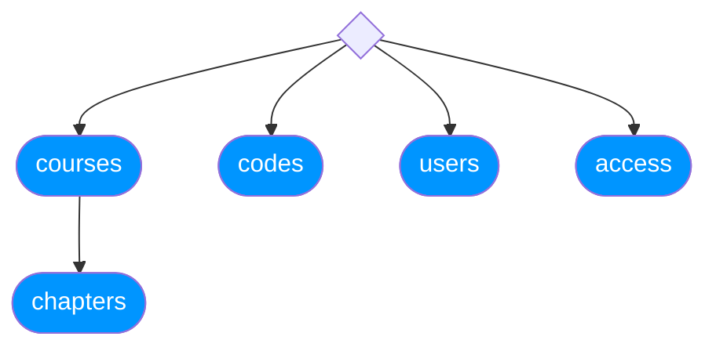
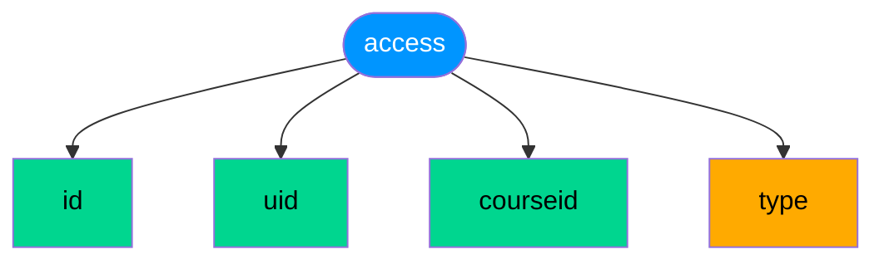
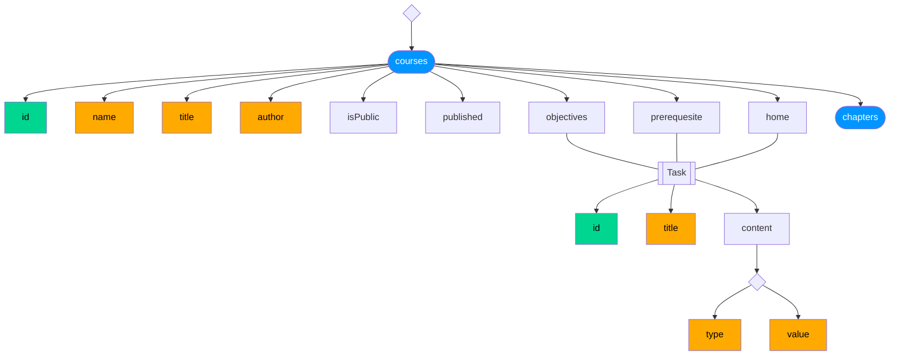
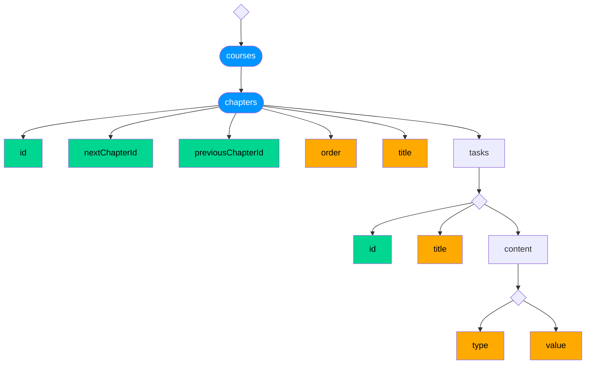
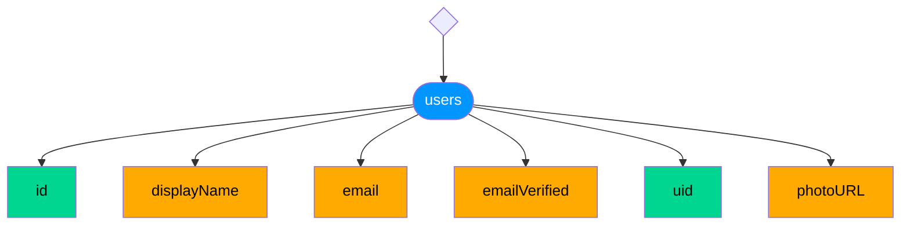
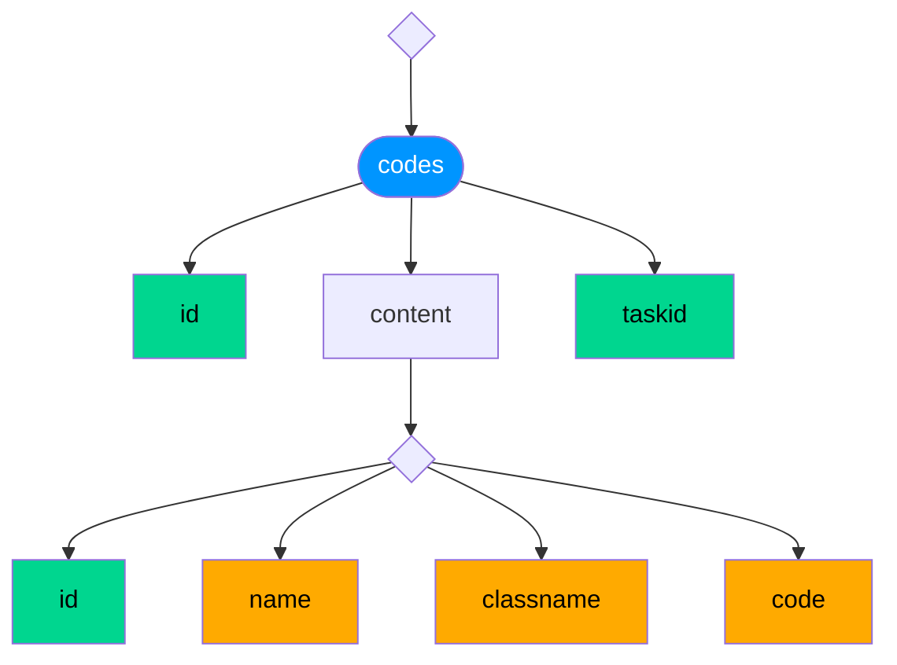

# Data model

## Root level collections

## `access` collection

## `courses` collection

The subcollection **access** will link all users uid that can access to this course
(authors for example).

