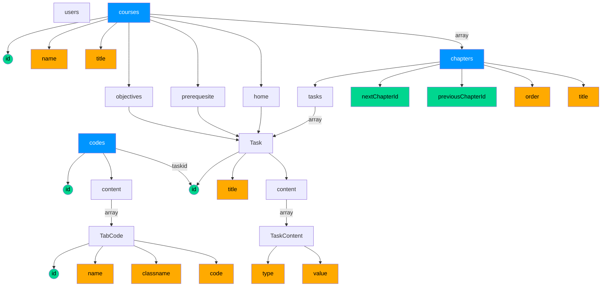

# Data model

```mermaid
graph TD

users

codes --> id3((id))
codes --> content2[content]
codes -- taskid --> id2
content2 --array--> TabCode

TabCode --> id4((id))
TabCode --> name2[name]
TabCode --> classname
TabCode --> code


courses --> id1((id))
courses --> name
courses --> title
courses --> objectives --> Task
courses --> prerequesite --> Task
courses --> home --> Task
courses --array--> chapters

Task --> id2((id))
Task --> title2[title]
Task --> content --array--> TaskContent
TaskContent --> type
TaskContent --> value

chapters --> tasks --array--> Task
chapters --> nextChapterId
chapters --> previousChapterId
chapters --> order
chapters --> title3[title]


classDef green fill:#00d68f,color:black;
classDef string fill:#ffaa00,color:black;
classDef collections fill:#0095ff,color:white;

class id1,id2,id3,id4,nextChapterId,previousChapterId green;
class name,title,title2,title3,type,value string;
class order string;
class name2,classname,code string;

class courses,chapters,codes collections;

```